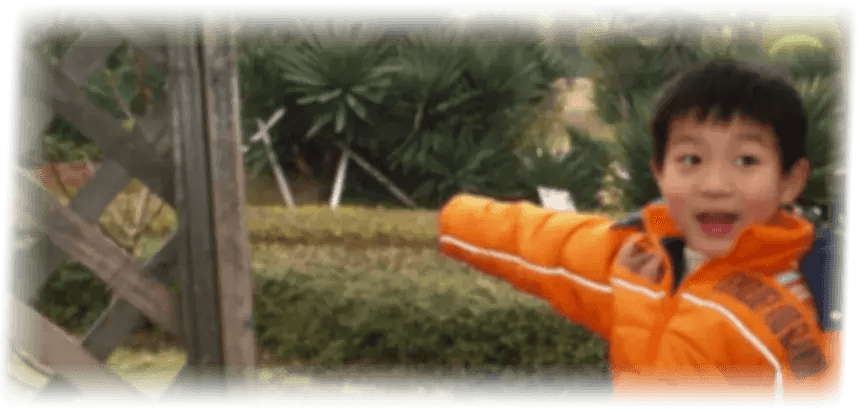

<!--
**GZ-Metal-Cell/GZ-Metal-Cell** is a ✨ _special_ ✨ repository because its `README.md` (this file) appears on your GitHub profile.

Here are some ideas to get you started:

- 🔭 I’m currently working on ...
- 🌱 I’m currently learning ...
- 👯 I’m looking to collaborate on ...
- 🤔 I’m looking for help with ...
- 💬 Ask me about ...
- 📫 How to reach me: ...
- 😄 Pronouns: ...
- ⚡ Fun fact: ...
-->

# GZ-Metal-Cell

---

You can call me **Xiao Z** 🤗. I’m **26** years old 🫣. I’m from **Fuzhou, Fujian Province** 😬, but I don’t speak the Fuzhou dialect 😶, and I don’t like seafood 😵... I guess I’m not a true Fuzhou person 😇.

According to the MBTI test, I’m an **INTJ** 🤔. But my room is always a mess, and I’m still **an introverted guy with some hidden charm** 🤤. I can’t stand formalism 😠, and I only like doing things that I enjoy 😕.

I used to be **a gaming addict** 😮‍💨. I’ve played all kinds of computer games since I was a kid 😆. I prefer racing games, strategy games, and open-world sandbox games, but I’m not really good at MOBA games 😅.

I’ve always been into gaming, but my studies were always a bit careless 🥱. I chose an interesting major in **Digital Media Technology** for my undergraduate studies 😍! I love using computers to create all sorts of fun things 😎! Well... writing papers isn’t one of those fun things 😒.

I’m skilled at installing and uninstalling software like Ps, Pr, Ai, Ae, An, etc. 🤪! Well... I’m at least familiar with some of them 🧐. I’ve also dabbled in 3D modeling software and game engines 🫢. I **aspire to become a versatile professional in the gaming industry** 😏! Although there’s still a long way to go 🥴.

I’m proficient in spelling words like C, C++, C#, Python, HTML, CSS, Javascript, etc. 🤠! Well... at least I can use them to write something 🙃.

I can swim, play badminton, enjoy photography, and play chess 🥸. Well... I’m still a beginner in all of them 😳... I once learned a bit of sketching, but I got too lazy to continue 🤐.

After the graduate entrance exam, I somehow ended up studying in **Hebei** 🤨, and by chance, I chose a major in **Artificial Intelligence** 🤫, becoming a **research “waste”** 😵. I’ve had a very different life experience here 🤧. I hope to travel and see more of my country’s beautiful landscapes during my graduate school breaks 🥳! And hopefully, I’ll graduate smoothly 😵‍💫.

Although there are still regrets about some people or things 🫤, **I don’t let things outside of me affect my happiness or sadness.** I hope to become a better version of myself in the future 🫡!

---

